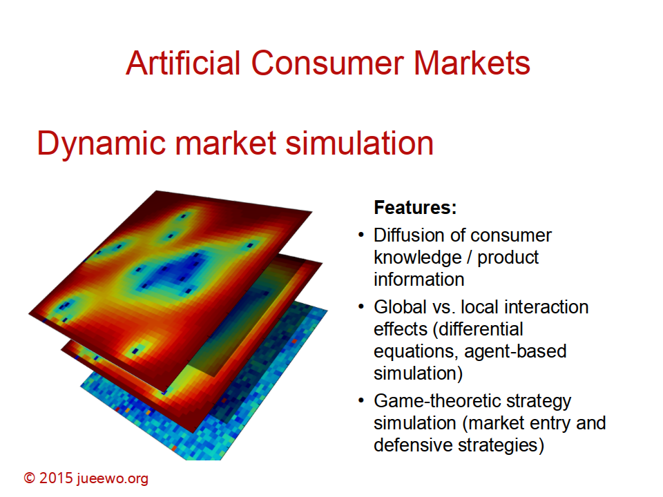
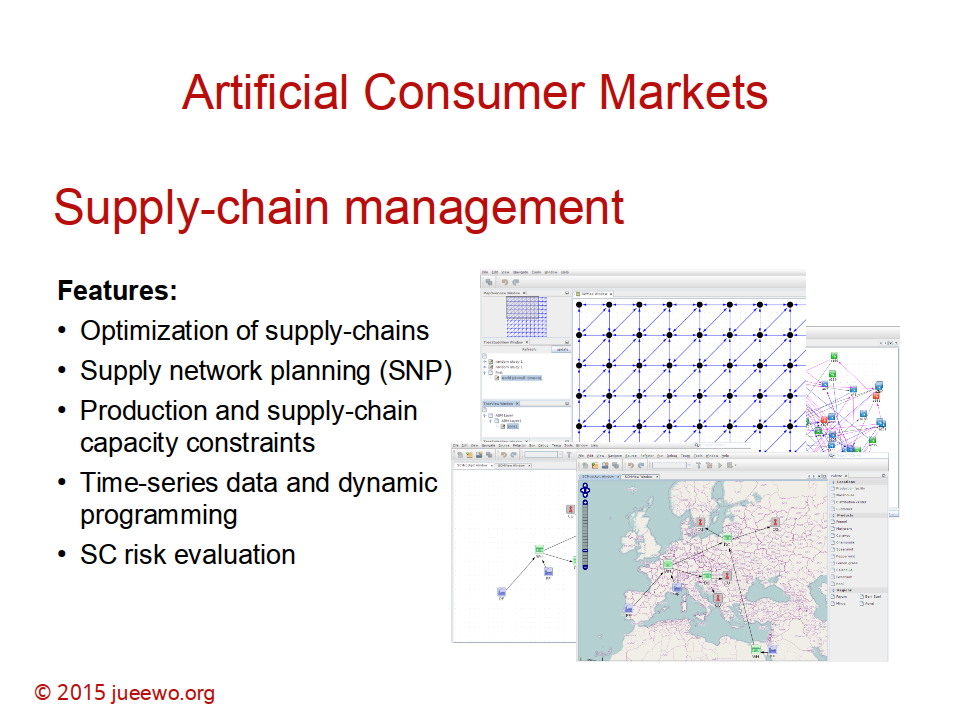

## Artificial Consumer Markets

The research project “Artificial Consumer Markets” is modeling the dynamic of business decisions in consumer markets. The research topics are covering a comprehensive range of strategic decision making, from product development to marketing and finance. focusing on dynamic interaction effects on markets. This approach allows the simulation of the trade-off between different (contradicting) strategic options and business decision.


--- 

### Research Topics

* Market entry strategies (defender model, Hauser & Shugan)
* Diffusion of product information (word-of-mouth)
* Local vs. global communication effects (word-of-mouth vs. mass marketing)
* Optimal market entry and defensive strategy (game theory)
* Prediction Markets (Crowdsourcing - the wisdom of the crowd)






<!-- 
 -->

--- 

### Features

#### Agent-based simulation
The core simulates the diffusion of consumer knowledge and product information. Global and local interactions are defining the optimal strategy.

#### Word-of-mouth
Communication is a relevant local effect to influence product perceptions. Different incentive structures are influencing the dynamic spread of knowledge.

#### Network effects
Network effects are essential for the interaction dynamic. Network structure and network formation processes are influencing the market dynamic.

#### Decision Support
The simulation output supports master planning and strategy optimization. The core model supports adaptive learning in applied information systems.

---

### Publications

#### Journal Article:

* Wöckl, Jürgen. 2006. Modelling Artificial Consumer Markets. Simulation News Europe 44/45 39-40.
* Schuster, U., Wöckl, J.. 2005. Optimal Defensive Strategies under Varying Consumer Distributional Patterns and Market Maturity. Journal of Economics and Management, Vol. 1, No. 2, pp. 187-206.

#### Chapter in Book:

* Wöckl, Jürgen. 2009. Interacting Advertising and Production Strategies – A Model Approach on Customers’ Communication Networks. In: Agent-Based Approaches in Economic and Social Complex Systems V, Hrsg. Terano, T.; Kita, H.; Takahashi, S.; Deguchi, H., 143-153. Tokyo: Springer.
* Mazanec, Josef, Schuster, Ulrike, Wöckl, Jürgen. 2006. Defensive Strategies and Consumers’ Bounded Rationality: An Artificial Market Simulation. In Advances in Doctoral Research in Management, Vol. 1, Hrsg. L. Moutinho and P. Rita, 105-134. London: World Scientific.
* Schuster, U., Wöckl, J.. 2005. A Continuous-Time ACM Model and Experiment. in: Taudes, A. (ed.), Adaptive Information Systems and Modelling in Economics and Management Science, Springer, Vienna-New York 2005, pp. 45-56.

#### Conference Proceedings:

* Wöckl, Jürgen. 2007. Interacting Advertising and Production Strategies – A Model Approach on Customers’ Communication Networks. In AESCS 07, Hrsg. Takao Terano, 222-231. Tokyo, Japan: Agent-Based Social Systems / Sciences.
* Wöckl, Jürgen. 2007. Modelling Advertising and Production Strategies using Cellular Automata. In Proceedings of the 6th EUROSIM Congress on Modelling and Simulation, Hrsg. Borut Zupancic, RIhard Karba, Saso Blazic, 201-201. Ljubljana, Slovenia: ARGESIM / ASIM – Verlag.
* Wöckl, Jürgen, Taudes, Alfred. 2006. A Hybrid Approach to Modelling Advertising Effects – An Application to Optimal Lying in Software Business. In The First World Congress on Social Simulation, vol. 1, Hrsg. Takao Terano, 175-182. Kyoto, Japan.
* Schuster, U., Wöckl, J.. 2004. Optimal defense strategies under varying consumer distributional patterns and market maturity. AMS Annual Conference, vol. XXVII, pp. 140-144.
* Wöckl, J., Schuster, U.. 2004. Derivation of stationary optimal defensive strategies using a continuous market model. AMS Annual Conference, vol. XXVII, pp. 305-311.

````plain
---
````