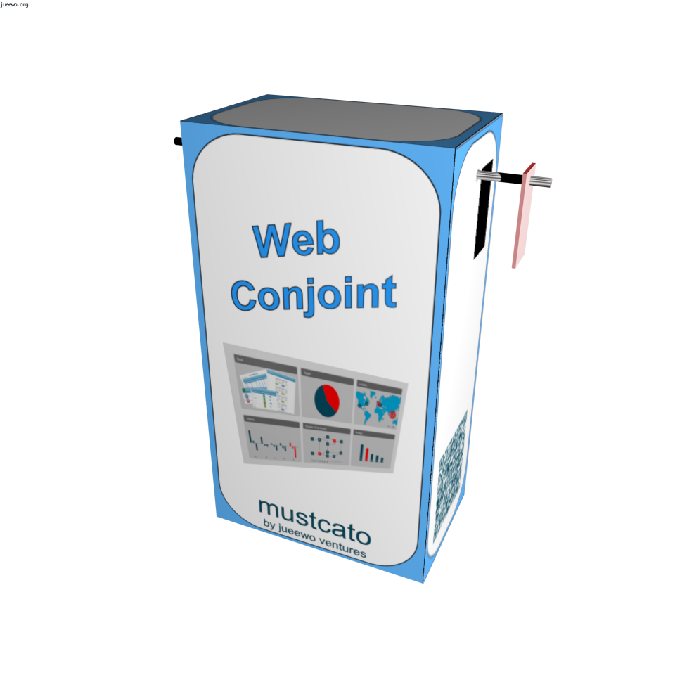

### *WebConjoint* 

*WebConjoint* measures preferences implicitly. This is crucial when (product) features need to be traded mutually. Many real-world decisions require to trade one feature for another, e.g. high quality and low price are precluding each other, so it’s necessary to trade quality for price or vice versa. Traditional measurements (e.g. surveys, interviews, etc.) are testing features separately (itemized). In the case of related features, traditional tools produce incorrect results.   The interactive tool WebConjoint is using a joint measurement of how the features of products and services are mutually traded. It provides a correct measure of the preferences and gives an insight into the customer's decision making.

--- 



---

### Features

#### Adaptive Conjoint
Adaptive conjoint creates the cards in real-time and based on the former user interactions. That allows a reduced number of evaluations and an instant learning of the user preferences.

#### Questionnaire & Survey
*WebConjoint* supports full online/mobile surveys with various question types, including Conjoint, MaxDiff, etc. The survey is white-labelled and allows individual branding.

#### Real-time analysis
*WebConjoint* allows real-time analysis and feed-back, for the participants and the researcher. A graphical dashboard shows the status and analytic results of the responses.

#### Mobile / Web / Social-media integration
Information and results can be shared on Social-media accounts, supporting a higher visibility of the study and additional responses. Posts can be tracked and analyzed.

---

<!--  -->

<!--  -->

<!-- 
 -->
